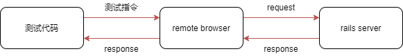

# Feature Test

Feature test 我理解为场景测试。这种测试一般会对某些场景进行模拟，比如注册、登录等。这种测试会包含多个操作，比如 fill / click 等。这种测试还经常会需要执行 js 等。我们可以在测试机器上启动 browser，然后向该 browser 发送测试指令，browser 再向服务器发送请求。当我们在使用 docker 的时候，很可能测试机器上并没有安装 browser，甚至有可能无法正确启动 browser。这个时候我们可以使用远程 browser 来进行测试。



## Remote chrome

```Dockerfile
# Dockerfile of remote chrome

version: "3.4"

services:
  chrome:
    image: 103.14.34.141:5000/selenium/standalone-chrome
    network_mode: "host"
    container_name: "chrome"
    restart: always
```

## Rspec config

```ruby
# spec/rails_helper.rb

# Add additional requires below this line. Rails is not loaded until this point!
require 'capybara/rspec'
require "selenium/webdriver"

Capybara.register_driver :selenium do |app|
  Capybara::Selenium::Driver.load_selenium
  client = Selenium::WebDriver::Remote::Http::Default.new
  chrome_capabilities = Selenium::WebDriver::Remote::Capabilities.chrome(
    "chromeOptions": { args: %w(headless) }
  )
  options = {browser: :remote, url: 'http://0.0.0.0:4444/wd/hub', http_client: client, desired_capabilities: chrome_capabilities}
  Capybara::Selenium::Driver.new(app, options)
end

Capybara.default_max_wait_time = 5
Capybara.javascript_driver = :selenium
```
