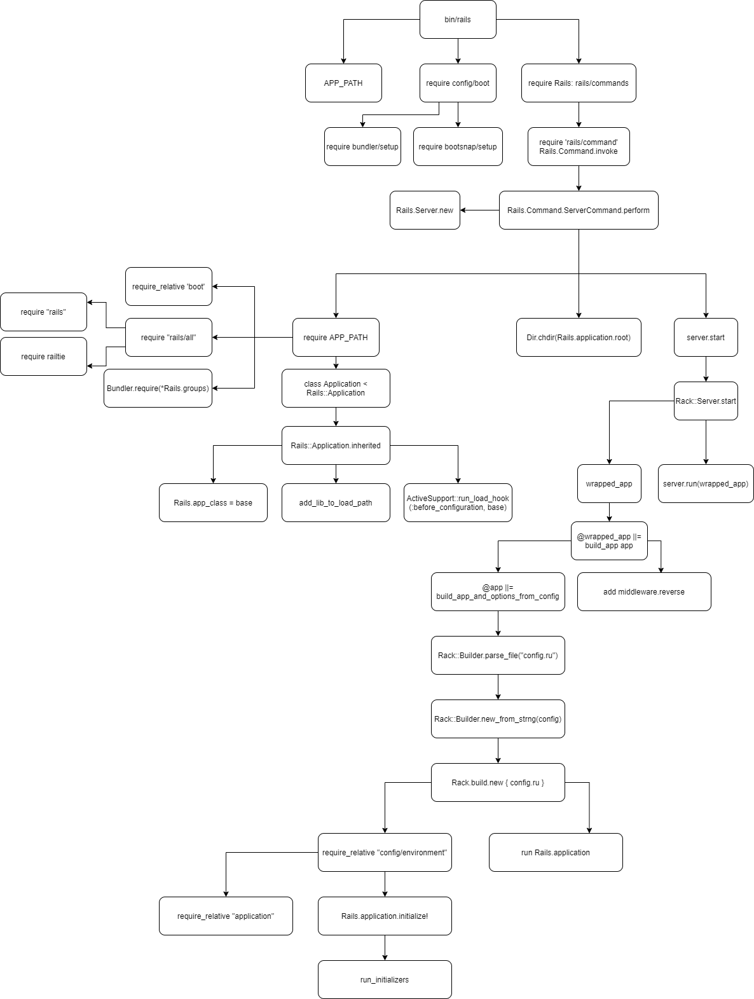

# Rails Boot Process

- [The Rails Initialization Process](https://guides.rubyonrails.org/initialization.html)
- [谈谈 Rack 的协议与实现](https://draveness.me/rack/)

## Many Commands

- bin/rails server
- bin/rails console
- bin/rails runner
- bin/rake route

## bin/rails



## config/boot.rb

## rails/commands

## rails/command

## rails/commands/server/server_command.rb

```ruby
def perform
  extract_environment_option_from_argument
  set_application_directory!
  prepare_restart

  Rails::Server.new(server_options).tap do |server|
    # Require application after server sets environment to propagate
    # the --environment option.
    require APP_PATH
    Dir.chdir(Rails.application.root)

    if server.serveable?
      print_boot_information(server.server, server.served_url)
      after_stop_callback = -> { say "Exiting" unless options[:daemon] }
      server.start(after_stop_callback)
    else
      say rack_server_suggestion(options[:using])
    end
  end
end
```

```ruby
module Rails
  class Server < ::Rack::Server
    def initialize(options = nil)
      @default_options = options || {}
      super(@default_options)
      set_environment
    end

    def start(after_stop_callback = nil)
      trap(:INT) { exit }
      create_tmp_directories
      setup_dev_caching
      log_to_stdout if options[:log_stdout]

      super()
    ensure
      after_stop_callback.call if after_stop_callback
    end
  end
end
```

## prepare Rails.application

```ruby
require 'application.rb'
```

```ruby
require_relative 'boot'
require 'rails/all'
Bundler.require(*Rails.groups)

module Sso
  class Application < Rails::Application
  # this will call the hook Rails::Application::inherited
  # execute ActiveSupport::run_load_hook(:before_configuration)
  end
end
```

## Initialize Web Server

Initialize the web server. If you do not assign it, it use the default web server, thin / puma / ... and so on.

```ruby
# Rack: lib/rack/server.rb

def server
  @_server ||= Rack::Handler.get(options[:server])

  unless @_server
    @_server = Rack::Handler.default

    # We already speak FastCGI
    @ignore_options = [:File, :Port] if @_server.to_s == 'Rack::Handler::FastCGI'
  end

  @_server
end
```

## Initialize app

```ruby
# Rack: lib/rack/server.rb

def app
  @app ||= options[:builder] ? build_app_from_string : build_app_and_options_from_config
end

def build_app_from_string
  Rack::Builder.new_from_string(self.options[:builder])
end

def build_app_and_options_from_config
  if !::File.exist? options[:config]
    abort "configuration #{options[:config]} not found"
  end

  return Rack::Builder.parse_file(self.options[:config])
end
```

```ruby
# Rack: lib/rack/builder

def self.new_from_string(builder_script, file = "(rackup)")
  binding, builder = TOPLEVEL_BINDING.eval('Rack::Builder.new.instance_eval { [binding, self] }')
  eval builder_script, binding, file

  return builder.to_app
end
```

实际上的做法是将 config.ru 中的内容读取成为一个字符串 builder_script . 最后通过 eval 方法执行下面的代码。

```ruby
Rack::Builder.new {
  builder_script
}.to_app
```

## Initialize wapped_app

```ruby
# Rack: lib/rack/server.rb

class << self
  def default_middleware_by_environment
    m = Hash.new {|h, k| h[k] = []}
    m["deployment"] = [
      [Rack::ContentLength],
      logging_middleware,
      [Rack::TempfileReaper]
    ]
    m["development"] = [
      [Rack::ContentLength],
      logging_middleware,
      [Rack::ShowExceptions],
      [Rack::Lint],
      [Rack::TempfileReaper]
    ]

    m
  end

  def middleware
    default_middleware_by_environment
  end
end

def middleware
  self.class.middleware
end

def build_app(app)
  middleware[options[:environment]].reverse_each do |middleware|
    middleware = middleware.call(self) if middleware.respond_to?(:call)
    next unless middleware
    klass, *args = middleware
    app = klass.new(app, *args)
  end
  app
end

def wrapped_app
  @wrapped_app ||= build_app app
end
```

wapped_app 只是比 app 多了几个默认的 middleware 而已。看起来似乎只是对 deployment / development 环境有效。

## Rack Server Start

```ruby
# Rack: lib/rack/server.rb

def start(&block)
  if includes = options[:include]
    $LOAD_PATH.unshift(*includes)
  end

  Array(options[:require]).each do |library|
    require library
  end

  check_pid! if options[:pid]

  handle_profiling(options[:heapfile], options[:profile_mode], options[:profile_file]) do
    wrapped_app
  end

  daemonize_app if options[:daemonize]

  write_pid if options[:pid]

  trap(:INT) do
    if server.respond_to?(:shutdown)
      server.shutdown
    else
      exit
    end
  end

  server.run(wrapped_app, **options, &block)
end
```
